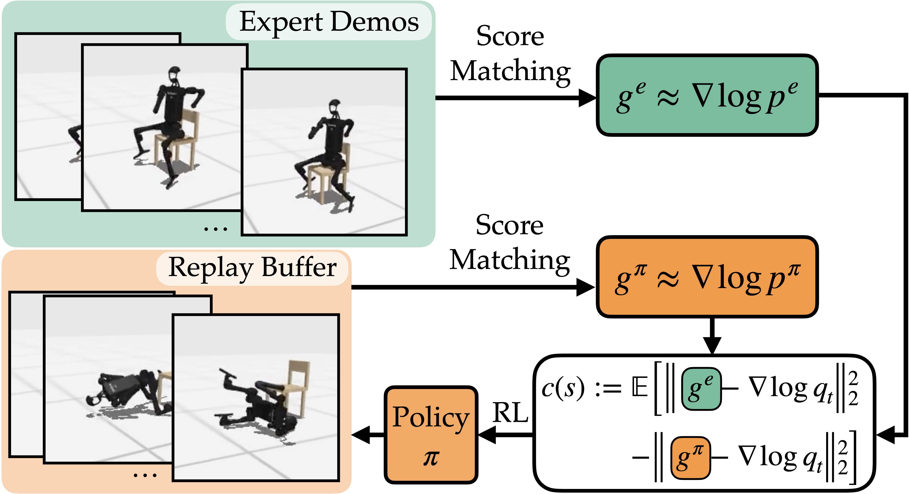

# 😊 SMILING: Score-Matching Imitation LearnING

This repository contains implementations of the algorithms presented in "Diffusing States and Matching Scores: A New Framework for Imitation Learning"

<p align="center">
  
</p>

## 🛠️ Installation 

Please run

```bash
conda create -n smiling python=3.10.14 -y
conda activate smiling
pip install -r requirements.txt
```

## 💻 Experiments

For all experiments, first activate the installed environment:

```bash
conda activate smiling
```

### Obtain Expert Demonstrations

You can either download the expert policies and demos we used in our experiments, or train your own expert policies and generate demos yourself. 

#### Option 1 (Recommended): Download Our Expert Policies and Demonstrations

The expert policies and demos we used can be downloaded [here](https://huggingface.co/runzhew/SMILING-expert). After downloading, simply place the downloaded `models` folder in the root directory of this repo.

#### Option 2: Train Your Own Expert Policies

If you prefer to train your own expert policies, run 

```bash
# To train expert policies for the DeepMind Control Suite envs (e.g., ball_in_cup_catch):
python train.py env=ball_in_cup_catch agent=sac

# To train expert policies for the HumanoidBench envs (e.g., humanoidbench_h1-crawl-v0):
python train.py env=humanoidbench_h1-crawl-v0 agent=dreamerv3
```

Training is set to run for 1e8 steps by default. You can stop it at any time once the expert performance is good enough, or you can set the `expert_num_train_steps` argument to reduce the number of steps. You can also train expert policies for other environments by changing the `env` argument. The list of environments can be found in the [env list](#environment-list) section.

Then, to generate state-only demonstrations, run

```bash
# To generate expert demos for DeepMind Control Suite envs (e.g., ball_in_cup_catch):
python gen.py env=ball_in_cup_catch agent=sac expert_path=[PATH_TO_YOUR_EXPERT]

# To generate expert demos for the HumanoidBench envs (e.g., humanoidbench_h1-crawl-v0):
python gen.py env=humanoidbench_h1-crawl-v0 agent=dreamerv3 expert_path=[PATH_TO_YOUR_EXPERT]
```

Replace `[PATH_TO_YOUR_EXPERT]` with the directory of your expert policy. For example, if your expert policy is saved in `models/ball_in_cup_catch_08.25.16.44.10.520979/100000`, set `[PATH_TO_YOUR_EXPERT]` to `ball_in_cup_catch_08.25.16.44.10.520979/100000` (omit the `models/`). The demonstrations will be saved in the same directory as the expert policy. To generate demonstrations with both states and actions, simply add `use_action=true` to the commands above.

### Environment List

We used the following environments in our experiments:

- DeepMind Control Suite: `ball_in_cup_catch`, `cheetah_run`, `humanoid_walk`
- HumanoidBench: `humanoidbench_h1-sit_simple-v0`, `humanoidbench_h1-crawl-v0`, `humanoidbench_h1-pole-v0`

We only support using SAC for DeepMind Control Suite and DreamerV3 for HumanoidBench and do not support other combinations (e.g., using SAC for HumanoidBench). This applied to all experiments in this repository. 

> [!NOTE]
> The `humanoid_bench` folder in this repo is copied from the [original repo](https://github.com/carlosferrazza/humanoid-bench), with the only modification being that we updated the `tasks.py` file to fix the episode length to 1,000 steps without early termination. Note that we didn't test our algorithm with flexible episode lengths (i.e., with early termination). Also, you are encouraged to install HumanoidBench directly from their original repo and manually apply this modification to acknowledge their contribution and also ensure you have the latest version.

### Run SMILING

Once the expert demonstrations are ready, we can proceed to run our algorithm. In the following steps, we assume you are using our generated expert policies and demonstrations. To switch to your own expert policies, simply modify the `expert_path` argument accordingly.

To reproduce our results of learning from state-only demonstrations, run

```bash
# For DeepMind Control Suite envs (e.g., ball_in_cup_catch):
python main.py env=ball_in_cup_catch expert_path=ball_in_cup_catch agent=sac alg=smiling

# For HumanoidBench envs (e.g., humanoidbench_h1-crawl-v0):
python main.py env=humanoidbench_h1-crawl-v0 expert_path=humanoidbench_crawl agent=dreamerv3 alg=smiling agent.run.num_envs=2 alg.t_sample_cnt=100
```

Training is set to run for 1e5 epochs by default (equivalent to 1e8 env steps). You can stop it at any time, or reduce the number of epochs by setting a smaller value for the `epochs` argument.

To reproduce the results of learning from state-action demonstrations, simply add `use_action=true` to the commands above.

To reproduce the results of linear score function, simply add `use_linear=true` to the commands. For example:
```bash
python main.py env=cheetah_run expert_path=cheetah_run agent=sac alg=smiling use_linear=true
```

To run the code with different seeds, simply set the `seed` argument. Our reported results are averaged over seeds 0, 1, 2, 3, and 4.


### Run Baselines

DAC is already implemented in our repo. To run it, simply replace `alg=smiling` with `alg=dac` in the commands. For example, to reproduce DAC's results of learning from state-only demonstrations, run
```bash
# For DeepMind Control Suite envs (e.g., ball_in_cup_catch):
python main.py env=ball_in_cup_catch expert_path=ball_in_cup_catch agent=sac alg=dac

# For HumanoidBench envs (e.g., humanoidbench_h1-crawl-v0):
python main.py env=humanoidbench_h1-crawl-v0 expert_path=humanoidbench_crawl agent=dreamerv3 alg=dac agent.run.num_envs=2
```

To reproduce the results of DAC learning from state-action demonstrations or using linear discriminator, simply add `use_action=true` or `use_linear=true` to the commands.

For IQ-Learn, we used the official implementation, which can be found [here](https://github.com/Div99/IQ-Learn).

## 💐 Acknowledgements

Our SAC implementation is based on [pytorch_sac](https://github.com/denisyarats/pytorch_sac), with only minor modifications made to integrate it into our framework. DreamerV3 is built upon the implementation provided in [humanoid-bench](https://github.com/carlosferrazza/humanoid-bench), which is derived from [dreamerv3](https://github.com/danijar/dreamerv3). 

Our DAC is based on the official repository: [google-research/dac](https://github.com/google-research/google-research/tree/master/dac). The results for IQ-Learn were generated using the official implementation from [IQ-Learn](https://github.com/Div99/IQ-Learn).


## 📝 Citation

TODO
